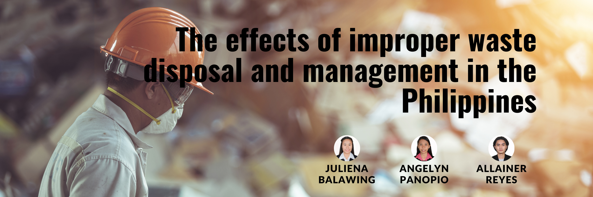
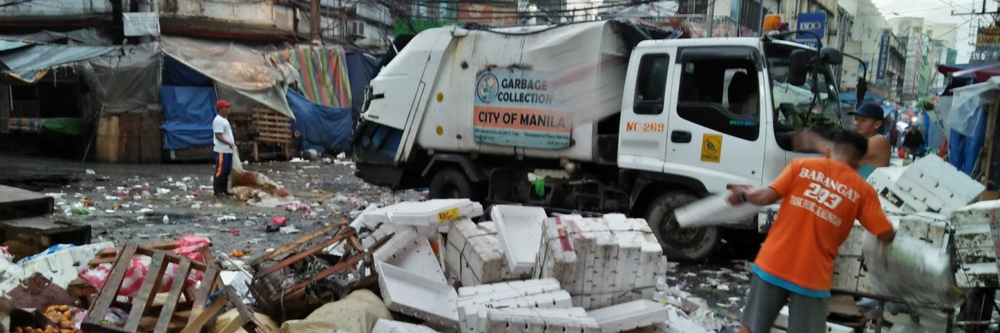

## INTRODUCTION

A waste management system, or waste disposal, is a streamlined process that organizations use to dispose of, reduce, reuse, and prevent waste. It is also an approach where companies implement comprehensive strategies to efficiently manage waste from its origin until its final disposal. Possible waste disposal methods are recycling, composting, incineration, landfills, bioremediation, waste to energy, and waste minimization. Waste management is important as it saves the environment from the toxic effects of inorganic and biodegradable elements present in waste. Mismanagement of waste can cause water contamination, soil erosion, and air contamination.

Waste can be recycled if collected and managed efficiently. Waste materials such as plastic, glass, and paper can be segregated into different columns in order to process them to make new products, which will save natural resources. Moreover, when this waste is not recycled, it usually ends up in landfills or oceans, posing a threat to human health and marine life. In most areas of the world, sewage treatment is not done properly, leading to eutrophication and beach closures. According to the World Wildlife Fund (WWF), an estimated 8 million tons of plastic end up in the oceans each year. Over the past few years, waste management has become a global concern. Commonly, waste is generated in households, factories, construction sites, refineries, and nuclear power plants. As the population increases, consumption trends are changing. Along with the improvement in lifestyle, it has posed alarming threats to the environment. If waste is not managed properly, it can cause serious problems for human health and the environment. So, it is necessary for people and businesses to know the importance of waste management.

The global community recognized that Solid Waste Management (SWM) is an issue that required serious attention. The aggressive pursuit of economic growth by developing countries like the Philippines has resulted in the manufacture, distribution, and use of products and the generation of waste that contribute to environmental degradation and global climate change. Available data showed that the Philippines ranks 9th among the countries at risk from climate change due to rising sea levels, intense storm surges, and droughts. This is heavily manifested in the frequent and intense floods the country is experiencing from devastating typhoons, which many claim are due to climate change. Along with the country's economic progress, the rapid growth in population has also made waste management a major environmental challenge for the country.

SDG 12 includes targets for reducing pollution and health impacts through environmentally sound management (ESM) of all waste throughout the product life cycle and promoting waste prevention, reduction, recycling, and reuse. Sustainable procurement is also required; almost all hospital waste comes through the front door as a product. Healthcare needs to leverage its buying power to ensure that the materials it purchases generate as little waste as possible that is toxic, non-repairable, non-recyclable, or simply unnecessary. By advocating for the replacement of these products with safer alternatives, the healthcare system can help kick-start the global circular economy.

Minimizing waste, segregating at the source, avoiding incineration, and recycling all conserve resources and energy. Research conducted by HCWH proved that autoclaving waste has CO2 emissions at least fifteen times lower than waste incineration. Organic wastes produce methane gas as they degrade, but if this is done in a controlled manner in a biodigester, the methane can be captured for use as a fuel. Because methane has a stronger greenhouse effect than carbon dioxide, burning it reduces the CO2 emissions of the waste.

These techniques all help mitigate climate change. Sustainable healthcare waste management technologies such as biodigestion and autoclaving can also play a role in making healthcare systems more resilient to disasters.

## STATEMENT OF THE PROBLEM

The contemporary economy's growing volume and complexity of trash pose a severe threat to ecosystems and public health. The environment has long been harmed by the waste that people produce. Because of our excessive waste production, we are unable to manage it sustainably. Our oceans and landfills are filled with waste that is not biodegradable and cannot be adequately recycled. All together, the amount of waste generated affects the environment in multiple ways: its contribution to the worsening climate crisis, its negative impact on wildlife and the natural environment, and its detriment to our very own public health. Improper waste disposal in the Philippines is a serious problem. Despite the efforts of the government and various non-governmental organizations to address the problem, there are still many areas in the country where waste is not properly managed.

One of the main causes of improper waste disposal is the lack of waste management infrastructure in many areas of the Philippines. Many communities do not have access to adequate facilities for waste treatment and disposal, which leads to the accumulation of garbage in the streets, rivers, and other bodies of water. Furthermore, the lack of awareness about the importance of proper waste management also contributes to the problem. Many people do not understand the dangers associated with improper waste disposal and continue to dump garbage anywhere that is convenient for them.

## SIGNIFICANCE OF THE STUDY

The Philippines is one of the countries that suffers from poor practices in waste disposal and waste management. Proper waste management and disposal can bring about a significant change in this problem. The proposed study is significant in providing awareness and supporting strict protocols regarding waste from households and infrastructure, which can help in maintaining a clean environment. The community can benefit from this in terms of health by protecting every individual from possible diseases that are caused by improper waste disposal and management, as well as organizations that are on a continuous mission of protecting and maintaining our environment. This can also provide a more in-depth study in the analysis of data on the effects of improper waste disposal and management in the Philippines for future researchers.

## METHODS

The researchers explored this proposed project through in-depth studies of the datasets from trusted websites and sources that provide crucial information for providing analytical reports and insights in the field of the problem. The researchers will analyze data that is connected to the effects of improper waste disposal and management in the Philippines and how proper waste disposal and management can help our country solve this problem, considering the public's health and safety from the said effects of the problem. The researchers will provide analytical insights from both improper and proper waste management and produce solutions and recommendations.

## RECOMMENDATION

The government should have strict implementation of waste segregation in every household and infrastructure. Providing more infrastructure that is equipped to dispose of waste in environmentally friendly ways should be given more attention by the government. In households, awareness should be strictly imposed, and every home must strictly follow waste segregation. In public, a fine or any other way to penalize people who violate the rules should be implemented, whether it is on the streets or in any public space. Consistency in implementation is what will make the project successful. Organizations that will be part of the restrictions on waste shall be properly oriented to provide proper guidance to the people of the community and attain a positive outcome.

## REFERENCES 
• https://www.jstage.jst.go.jp/article/jsmcwm/24/0/24_677/_pdf
• https://noharm-global.org/issues/global/health-care-waste-management-and-sustainable-development-goals
• https://safetyculture.com/topics/waste-management-system/?fbclid=IwAR0io6SODlPisVZ92GBvF2wpOaPlBM2wNCOp0VCpb2LaZgkmK1bzryRwyRA
• https://myethicalchoice.com/en/journal/waste-management/the-importance-of-waste-management/
• https://www.adb.org/sites/default/files/publication/29301/garbage-book.pdf

