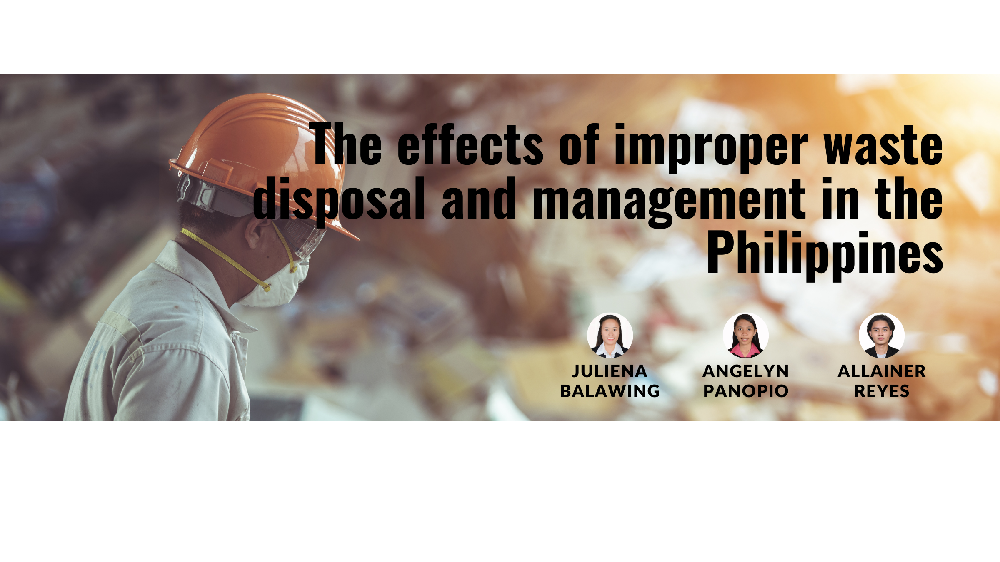

## Introduction

A waste management system, or waste disposal, is a streamlined process that organizations use to dispose of, reduce, reuse, and prevent waste. It is also an approach where companies implement comprehensive strategies to efficiently manage waste from its origin until its final disposal. Possible waste disposal methods are recycling, composting, incineration, landfills, bioremediation, waste to energy, and waste minimization. Waste management is important as it saves the environment from the toxic effects of inorganic and biodegradable elements present in waste. Mismanagement of waste can cause water contamination, soil erosion, and air contamination.

Waste can be recycled if collected and managed efficiently. Waste materials such as plastic, glass, and paper can be segregated into different columns in order to process them to make new products, which will save natural resources. Moreover, when this waste is not recycled, it usually ends up in landfills or oceans, posing a threat to human health and marine life. In most areas of the world, sewage treatment is not done properly, leading to eutrophication and beach closures. According to the World Wildlife Fund (WWF), an estimated 8 million tons of plastic end up in the oceans each year. Over the past few years, waste management has become a global concern. Commonly, waste is generated in households, factories, construction sites, refineries, and nuclear power plants. As the population increases, consumption trends are changing. Along with the improvement in lifestyle, it has posed alarming threats to the environment. If waste is not managed properly, it can cause serious problems for human health and the environment. So, it is necessary for people and businesses to know the importance of waste management.

The global community recognized that Solid Waste Management (SWM) is an issue that required serious attention. The aggressive pursuit of economic growth by developing countries like the Philippines has resulted in the manufacture, distribution, and use of products and the generation of waste that contribute to environmental degradation and global climate change. Available data showed that the Philippines ranks 9th among the countries at risk from climate change due to rising sea levels, intense storm surges, and droughts. This is heavily manifested in the frequent and intense floods the country is experiencing from devastating typhoons, which many claim are due to climate change. Along with the country's economic progress, the rapid growth in population has also made waste management a major environmental challenge for the country.
